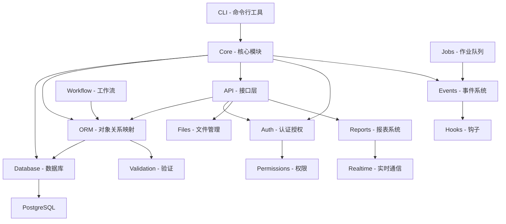
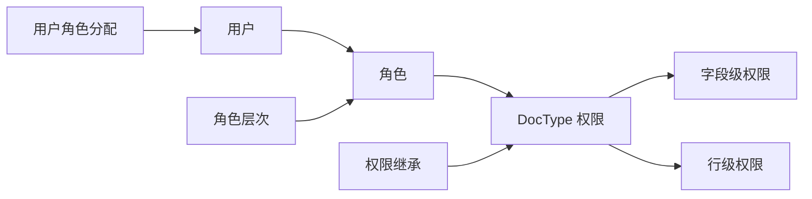
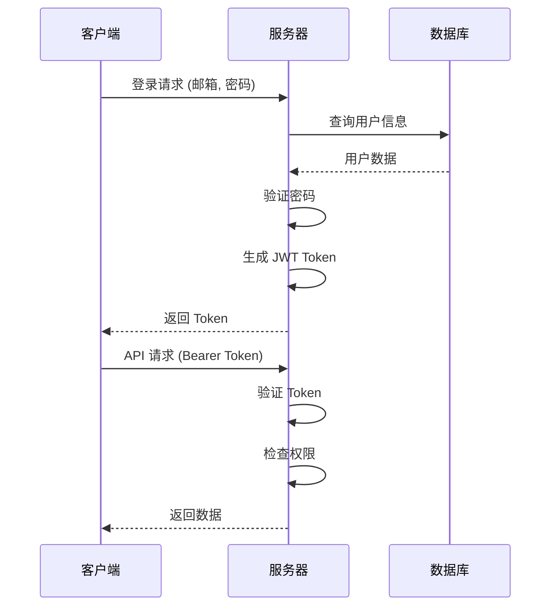
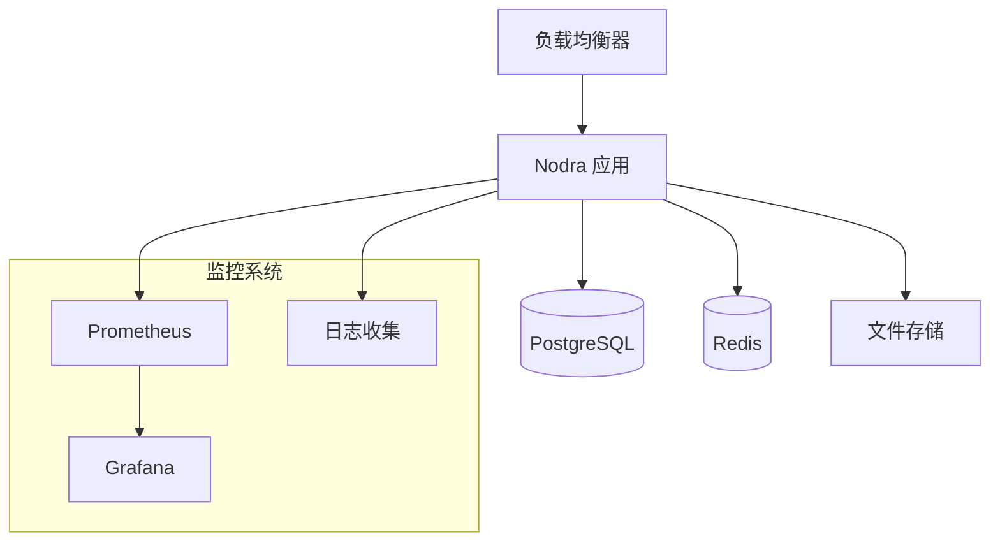
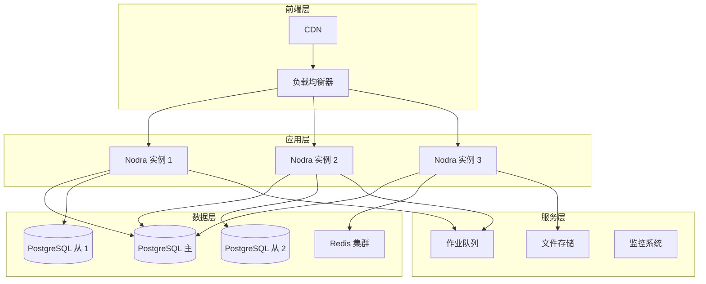

# Nodra 框架 - 架构设计

## 1. 概述

Nodra 是一个基于 Node.js + TypeScript + PostgreSQL 构建的元数据驱动全栈 Web 框架，灵感来源于 [Frappe Framework](https://frappeframework.com/)。其核心哲学是：**一切皆 DocType**，框架从元数据定义自动生成数据库模式、REST API、验证规则和权限检查。

### 核心原则

- **元数据驱动**：DocType JSON 定义是单一真实来源
- **约定优于配置**：合理的默认值，最小化样板代码
- **自动生成**：从 DocType 定义生成数据库表、REST API、验证
- **生命周期钩子**：通过钩子和事件扩展文档生命周期
- **多应用架构**：基于框架构建可安装的应用
- **类型安全**：完整 TypeScript 严格模式

### 技术栈

| 组件      | 选择                    | 理由                            |
| --------- | ----------------------- | ------------------------------- |
| 运行时    | Node.js 20+ (ESM)       | LTS，原生 ESM 支持              |
| 语言      | TypeScript 5.x (strict) | 类型安全，开发体验              |
| HTTP 框架 | Fastify 5.x             | 高性能，插件架构，JSON Schema   |
| 数据库    | PostgreSQL 15+          | JSONB，高级索引，可靠性         |
| DB 驱动   | pg (node-postgres)      | 成熟，底层控制，自定义 ORM      |
| 测试      | Vitest                  | 快速，ESM 原生，TypeScript 优先 |
| 包管理器  | pnpm                    | 高效，工作区支持                |
| 构建      | tsup                    | 快速 TypeScript 打包，ESM 输出  |

---

## 2. 核心概念

### 2.1 DocType

DocType 是 Nodra 中的核心抽象，相当于传统 ORM 中的"模型"但更丰富。DocType 定义包括：

- **模式**：字段定义，包含类型、约束和选项
- **行为**：命名规则、工作流状态、权限
- **呈现提示**：字段排序、分区、可见性

```jsonc
// doctypes/core/todo/todo.json
{
  "name": "Todo",
  "module": "Core",
  "naming_rule": "autoincrement",
  "is_submittable": false,
  "is_child": false,
  "fields": [
    {
      "fieldname": "description",
      "fieldtype": "Text",
      "label": "描述",
      "reqd": 1,
    },
    {
      "fieldname": "status",
      "fieldtype": "Select",
      "label": "状态",
      "options": "Open\nIn Progress\nCompleted",
      "default": "Open",
    },
    {
      "fieldname": "priority",
      "fieldtype": "Select",
      "label": "优先级",
      "options": "Low\nMedium\nHigh",
      "default": "Medium",
    },
  ],
  "permissions": [
    {
      "role": "System Manager",
      "read": 1,
      "write": 1,
      "create": 1,
      "delete": 1,
    },
    {
      "role": "All",
      "read": 1,
      "if_owner": 1,
    },
  ],
}
```

### 2.2 Document

Document 是 DocType 的运行时实例，代表数据库中的一行记录。每个 Document 都有：

- **标准字段**：name, owner, creation, modified, modified_by, docstatus, idx
- **业务字段**：在 DocType 中定义的字段
- **生命周期状态**：draft, submitted, cancelled
- **权限上下文**：基于角色的访问控制

```typescript
// Document 实例
interface Document {
  // 标准字段（自动添加）
  name: string; // 主键
  owner: string; // 创建者
  creation: Date; // 创建时间
  modified: Date; // 修改时间
  modified_by: string; // 最后修改者
  docstatus: number; // 文档状态 (0=draft, 1=submitted, 2=cancelled)
  idx: number; // 排序索引

  // 业务字段（来自 DocType 定义）
  description?: string;
  status?: string;
  priority?: string;

  // 运行时属性
  __islocal?: boolean; // 是否新记录
  __unsaved?: boolean; // 是否未保存
}
```

### 2.3 Naming Rules

命名规则定义了如何生成文档的主键：

| 规则类型        | 示例                   | 说明         |
| --------------- | ---------------------- | ------------ |
| `autoincrement` | TODO-0001              | 自增数字格式 |
| `byfieldname`   | CUST-001               | 基于字段值   |
| `prompt`        | 用户手动输入           | 交互式命名   |
| `format`        | INV-{YYYY}-{MM}-{####} | 格式化字符串 |

### 2.4 Child DocType

Child DocType 嵌套在父文档中，表示一对多关系：

```jsonc
{
  "name": "Todo Item",
  "is_child": 1,
  "parentfield": "items",
  "fields": [
    {
      "fieldname": "description",
      "fieldtype": "Text",
      "label": "项目描述",
    },
    {
      "fieldname": "completed",
      "fieldtype": "Check",
      "label": "已完成",
    },
  ],
}
```

---

## 3. 模块架构

### 3.1 模块依赖图



### 3.2 核心模块详解

#### Core Module (核心模块)

```
src/core/
├── config.ts              # 配置管理
├── errors.ts              # 错误类层次结构
├── doctype/               # DocType 系统
│   ├── loader.ts          # DocType 加载器
│   ├── field-types.ts     # 字段类型定义
│   └── schema.ts          # 模式验证
├── naming/                # 命名规则
│   ├── strategies.ts      # 命名策略
│   └── generator.ts       # 名称生成器
└── logger.ts              # 日志系统
```

**核心职责：**

- 配置管理和环境设置
- 错误处理和异常层次
- DocType 元数据管理
- 命名规则处理
- 日志记录

#### Database Module (数据库模块)

```
src/database/
├── connection.ts          # 数据库连接池管理
├── query-builder.ts       # 查询构建器
├── schema-sync.ts         # 模式同步
├── migrations/            # 数据库迁移
│   ├── runner.ts          # 迁移执行器
│   └── templates/         # 迁移模板
└── utils/                 # 数据库工具
    ├── index.ts           # 索引管理
    └── backup.ts          # 备份工具
```

**核心职责：**

- 数据库连接池管理
- 动态查询构建
- 模式自动同步
- 迁移管理
- 性能优化

#### ORM Module (对象关系映射)

```
src/orm/
├── document.ts            # Document 类
├── crud.ts                # CRUD 操作
├── validation.ts          # 数据验证
├── transactions.ts        # 事务管理
├── cache.ts               # 缓存层
└── controllers/            # 控制器基类
    └── base.ts            # 基础控制器
```

**核心职责：**

- Document 对象管理
- CRUD 操作封装
- 数据验证
- 事务处理
- 缓存集成

#### API Module (接口层)

```
src/api/
├── server.ts              # Fastify 服务器
├── routes/                # 路由定义
│   ├── resource.ts        # 资源端点
│   ├── method.ts          # 方法端点
│   └── auth.ts            # 认证端点
├── middleware/            # 中间件
│   ├── auth.ts            # 认证中间件
│   ├── permissions.ts     # 权限检查
│   └── rate-limit.ts      # 限流
├── serializers/           # 序列化器
│   ├── json.ts            # JSON 序列化
│   └── csv.ts             # CSV 导出
└── websocket.ts           # WebSocket 处理
```

**核心职责：**

- HTTP API 服务器
- RESTful 路由
- 认证和授权
- 请求序列化
- WebSocket 支持

---

## 4. 数据模型

### 4.1 数据库表约定

#### 标准表结构

每个 DocType 对应一个数据库表，遵循以下约定：

```sql
-- 表名规则：tab_{snake_case(doctype_name)}
CREATE TABLE tab_todo (
    -- 主键（字符串类型，支持自定义命名）
    name VARCHAR(140) PRIMARY KEY,

    -- 标准字段（自动添加）
    owner VARCHAR(140) NOT NULL,
    creation TIMESTAMP NOT NULL DEFAULT NOW(),
    modified TIMESTAMP NOT NULL DEFAULT NOW(),
    modified_by VARCHAR(140) NOT NULL,
    docstatus INTEGER NOT NULL DEFAULT 0,
    idx INTEGER NOT NULL DEFAULT 0,

    -- 业务字段（来自 DocType 定义）
    description TEXT,
    status VARCHAR(140),
    priority VARCHAR(140)
);

-- 子表额外字段
CREATE TABLE tab_todo_item (
    -- ... 标准字段
    parent VARCHAR(140) NOT NULL,        -- 父文档名称
    parenttype VARCHAR(140) NOT NULL,     -- 父 DocType
    parentfield VARCHAR(140) NOT NULL,   -- 父字段名

    -- ... 业务字段
);
```

#### 索引策略

```sql
-- 自动创建的索引
CREATE INDEX idx_tab_todo_name ON tab_todo(name);
CREATE INDEX idx_tab_todo_modified ON tab_todo(modified);
CREATE INDEX idx_tab_todo_owner ON tab_todo(owner);
CREATE INDEX idx_tab_todo_status ON tab_todo(status);

-- Link 字段索引
CREATE INDEX idx_tab_todo_customer ON tab_todo(customer);

-- 复合索引（常见查询模式）
CREATE INDEX idx_tab_todo_status_priority ON tab_todo(status, priority DESC);

-- 全文搜索索引
CREATE INDEX idx_tab_todo_search ON tab_todo USING gin(to_tsvector('english', description || ' ' || status));
```

### 4.2 字段类型映射

| DocType 字段类型 | PostgreSQL 类型 | 特殊处理   |
| ---------------- | --------------- | ---------- |
| Data             | DATE            | 自动格式化 |
| Datetime         | TIMESTAMP       | 时区处理   |
| Time             | TIME            | 时间验证   |
| Text             | TEXT            | 长度限制   |
| Long Text        | TEXT            | 无限制     |
| Code             | VARCHAR(140)    | 唯一验证   |
| Name             | VARCHAR(140)    | 命名规则   |
| Small Int        | SMALLINT        | 范围验证   |
| Int              | INTEGER         | 范围验证   |
| Big Int          | BIGINT          | 范围验证   |
| Float            | DECIMAL(18,6)   | 精度处理   |
| Percent          | DECIMAL(5,2)    | 百分比验证 |
| Currency         | DECIMAL(18,6)   | 货币格式   |
| Check            | BOOLEAN         | 布尔值     |
| Select           | VARCHAR(140)    | 选项验证   |
| Link             | VARCHAR(140)    | 外键引用   |
| Table            | JSONB           | 子表存储   |
| Attach           | VARCHAR(140)    | 文件引用   |
| HTML             | TEXT            | HTML 清理  |
| JSON             | JSONB           | JSON 验证  |

---

## 5. 安全模型

### 5.1 权限系统架构



#### 权限层次结构

1. **系统级权限**：系统管理、用户管理
2. **DocType 级权限**：创建、读取、写入、删除
3. **字段级权限**：特定字段访问控制
4. **行级权限**：基于条件的记录访问

```typescript
interface DocTypePermission {
  role: string; // 角色名称
  read: number; // 读取权限 (0/1)
  write: number; // 写入权限 (0/1)
  create: number; // 创建权限 (0/1)
  delete: number; // 删除权限 (0/1)
  submit?: number; // 提交权限 (0/1)
  cancel?: number; // 取消权限 (0/1)
  if_owner?: number; // 所有者权限 (0/1)
  permlevel?: number; // 权限级别
  condition?: string; // 条件表达式
}
```

### 5.2 认证机制

#### JWT Token 结构

```typescript
interface JWTPayload {
  sub: string; // 用户邮箱
  name: string; // 用户名
  role: string[]; // 用户角色
  iat: number; // 签发时间
  exp: number; // 过期时间
  sid: string; // 会话 ID
}
```

#### 认证流程



---

## 6. 事件系统

### 6.1 事件类型

#### 文档事件

```typescript
// 文档生命周期事件
interface DocumentEvents {
  before_validate: (doc: Document) => void;
  validate: (doc: Document) => void;
  before_save: (doc: Document) => void;
  after_save: (doc: Document) => void;
  before_submit: (doc: Document) => void;
  after_submit: (doc: Document) => void;
  before_cancel: (doc: Document) => void;
  after_cancel: (doc: Document) => void;
  before_delete: (doc: Document) => void;
  after_delete: (doc: Document) => void;
}
```

#### 系统事件

```typescript
// 系统级事件
interface SystemEvents {
  app_installed: (app: string) => void;
  app_uninstalled: (app: string) => void;
  migration_start: (version: string) => void;
  migration_complete: (version: string) => void;
  user_login: (user: string) => void;
  user_logout: (user: string) => void;
}
```

### 6.2 钩子系统

```typescript
// 钩子注册示例
export class TodoController extends BaseController {
  // 验证钩子
  async validate(doc: Document): Promise<void> {
    if (!doc.description?.trim()) {
      throw new ValidationError('Description is required');
    }
  }

  // 保存前钩子
  async beforeSave(doc: Document): Promise<void> {
    // 设置优先级
    if (!doc.priority) {
      doc.priority = 'Medium';
    }

    // 设置截止日期（如果状态为高优先级）
    if (doc.priority === 'High' && !doc.due_date) {
      doc.due_date = new Date(Date.now() + 24 * 60 * 60 * 1000);
    }
  }

  // 保存后钩子
  async afterSave(doc: Document): Promise<void> {
    // 发送通知
    if (doc.status === 'Completed') {
      await this.sendCompletionNotification(doc);
    }
  }
}
```

---

## 7. 实时通信

### 7.1 WebSocket 架构

```typescript
// WebSocket 服务器配置
export class RealtimeServer {
  private io: Server;
  private rooms: Map<string, Set<string>> = new Map();

  constructor(server: http.Server) {
    this.io = new Server(server, {
      cors: { origin: '*' },
      transports: ['websocket', 'polling'],
    });

    this.setupEventHandlers();
  }

  // 房间管理
  async joinRoom(socket: Socket, room: string, data?: any): Promise<void> {
    await socket.join(room);

    if (!this.rooms.has(room)) {
      this.rooms.set(room, new Set());
    }
    this.rooms.get(room)!.add(socket.id);

    // 广播加入事件
    socket.to(room).emit('user_joined', {
      user: socket.data.user,
      room,
      timestamp: new Date(),
    });
  }

  // 文档变更广播
  broadcastDocumentChange(doctype: string, name: string, change: any): void {
    const room = `doc_${doctype}_${name}`;
    this.io.to(room).emit('doc_change', {
      doctype,
      name,
      change,
      timestamp: new Date(),
    });
  }
}
```

### 7.2 实时事件类型

| 事件类型          | 触发条件   | 数据格式                              |
| ----------------- | ---------- | ------------------------------------- |
| `doc_change`      | 文档保存   | {doctype, name, change, user}         |
| `doc_create`      | 新文档创建 | {doctype, name, doc, user}            |
| `doc_delete`      | 文档删除   | {doctype, name, user}                 |
| `workflow_change` | 工作流变更 | {doctype, name, from_state, to_state} |
| `notification`    | 系统通知   | {type, title, message, data}          |

---

## 8. 插件系统

### 8.1 插件架构

```typescript
// 插件接口定义
export interface NodraPlugin {
  name: string;
  version: string;
  dependencies?: string[];

  // 插件生命周期
  install(): Promise<void>;
  uninstall(): Promise<void>;
  activate(): Promise<void>;
  deactivate(): Promise<void>;

  // 钩子注册
  registerHooks(): HookRegistration[];
  registerDocTypes(): DocTypeDefinition[];
  registerAPIRoutes(): APIRoute[];
  registerMigrations(): Migration[];
}
```

### 8.2 核心插件

#### 1. 作业队列插件

```typescript
export class JobQueuePlugin implements NodraPlugin {
  name = 'job-queue';
  version = '1.0.0';

  async install(): Promise<void> {
    // 创建作业相关表
    await this.createJobTables();
    // 注册事件监听器
    this.registerEventListeners();
  }

  registerHooks(): HookRegistration[] {
    return [
      {
        event: 'after_save',
        handler: this.queueBackgroundJobs,
        priority: 10,
      },
    ];
  }
}
```

#### 2. 报表系统插件

```typescript
export class ReportPlugin implements NodraPlugin {
  name = 'reports';
  version = '1.0.0';

  registerAPIRoutes(): APIRoute[] {
    return [
      {
        method: 'GET',
        path: '/api/reports/:name',
        handler: this.generateReport,
        middleware: ['auth', 'permissions'],
      },
    ];
  }
}
```

---

## 9. 部署架构

### 9.1 单机部署



### 9.2 分布式部署



---

## 10. 性能优化

### 10.1 数据库优化

#### 连接池配置

```typescript
export const dbPool = new Pool({
  host: process.env.DB_HOST,
  port: parseInt(process.env.DB_PORT || '5432'),
  database: process.env.DB_NAME,
  user: process.env.DB_USER,
  password: process.env.DB_PASSWORD,

  // 连接池设置
  min: 5, // 最小连接数
  max: 20, // 最大连接数
  idleTimeoutMillis: 30000, // 空闲超时
  connectionTimeoutMillis: 5000, // 连接超时

  // 性能优化
  keepAlive: true,
  keepAliveInitialDelayMillis: 10000,
});
```

#### 查询优化

```typescript
// 批量操作优化
export class BulkOperations {
  async bulkInsert(documents: any[]): Promise<void> {
    const values = documents.map((doc) => this.formatValues(doc));

    const query = `
      INSERT INTO tab_todo (name, description, status)
      VALUES ${values.map((_, i) => `($${i * 3 + 1}, $${i * 3 + 2}, $${i * 3 + 3})`).join(', ')}
      RETURNING name
    `;

    await dbPool.query(query, values.flat());
  }
}
```

### 10.2 缓存策略

#### 多级缓存

```typescript
export class CacheManager {
  // L1: 内存缓存
  private l1Cache = new LRUCache<string, any>({
    max: 1000,
    ttl: 5 * 60 * 1000, // 5分钟
  });

  // L2: Redis 缓存
  private l2Cache = new Redis({
    host: process.env.REDIS_HOST,
    port: parseInt(process.env.REDIS_PORT || '6379'),
  });

  async get(key: string): Promise<any> {
    // 先查 L1
    let value = this.l1Cache.get(key);
    if (value) return value;

    // 再查 L2
    const l2Value = await this.l2Cache.get(key);
    if (l2Value) {
      value = JSON.parse(l2Value);
      this.l1Cache.set(key, value);
      return value;
    }

    return null;
  }
}
```

---

## 11. 测试策略

### 11.1 测试层次

```mermaid
pyramid
    title 测试金字塔

    E2E "端到端测试" : 5
    Integration "集成测试" : 15
    Unit "单元测试" : 80
```

### 11.2 测试配置

```typescript
// vitest.config.ts
export default defineConfig({
  test: {
    globals: true,
    environment: 'node',
    include: ['tests/**/*.test.ts'],
    exclude: ['node_modules', 'dist'],

    // 覆盖率要求
    coverage: {
      provider: 'v8',
      reporter: ['text', 'html'],
      exclude: ['tests/', 'node_modules/', 'dist/', '**/*.d.ts'],
      thresholds: {
        global: {
          branches: 80,
          functions: 80,
          lines: 80,
          statements: 80,
        },
      },
    },
  },
});
```

---

## 12. 未来规划

### 12.1 短期目标 (3-6个月)

- ✅ 完成 DocType 核心系统
- ✅ 实现 REST API 基础功能
- 🔄 完善权限和认证系统
- 🔄 添加文件管理功能
- 📋 实现报表系统

### 12.2 中期目标 (6-12个月)

- 📋 插件系统完善
- 📋 工作流引擎
- 📋 实时通信优化
- 📋 性能监控面板
- 📋 CLI 工具集

### 12.3 长期目标 (1-2年)

- 📋 多租户支持
- 📋 微服务架构
- 📋 GraphQL API
- 📋 AI 辅助开发
- 📋 云原生部署

---

## 13. 总结

Nodra 框架的设计理念是**元数据驱动**和**约定优于配置**，通过 DocType 定义自动化生成应用基础设施，让开发者专注于业务逻辑而非样板代码。

### 核心优势

1. **开发效率**：自动生成 API、数据库、验证逻辑
2. **类型安全**：完整 TypeScript 支持
3. **灵活扩展**：插件系统和钩子机制
4. **企业级**：完善的权限、审计、部署方案
5. **国际化**：中英文双语文档和社区支持

### 适用场景

- **企业管理系统**：ERP、CRM、HRM
- **业务流程系统**：工作流、审批流
- **数据管理平台**：数据分析、报表系统
- **SaaS 应用**：多租户、订阅管理
- **快速原型**：MVP 开发、概念验证

Nodra 框架旨在为现代 Web 应用开发提供一个强大、灵活、易用的基础平台。
