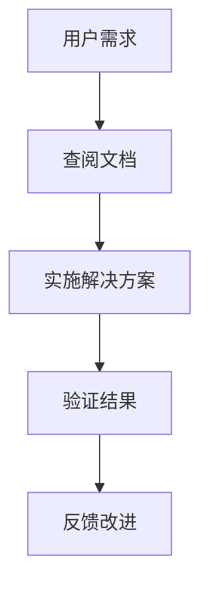

# Nodra 框架 (中文文档)

本目录包含 Nodra 框架的中文文档。

## 📚 文档列表

### 核心文档

- [架构设计](./ARCHITECTURE.md) - 系统架构和设计原理
- [API 参考](./API_REFERENCE.md) - REST API 完整参考
- [部署指南](./DEPLOYMENT.md) - 生产环境部署最佳实践
- [故障排除](./TROUBLESHOOTING.md) - 常见问题解决方案
- [性能优化](./PERFORMANCE.md) - 大规模应用性能调优
- [开发路线图](./ROADMAP.md) - 详细开发计划

### 开发指南

- [快速开始](./QUICK_START.md) - 5分钟上手指南 _(规划中)_
- [开发者指南](./DEVELOPER_GUIDE.md) - 详细开发教程 _(规划中)_
- [插件开发](./PLUGIN_DEVELOPMENT.md) - 自定义插件开发 _(规划中)_

### 用户文档

- [用户手册](./USER_MANUAL.md) - 最终用户使用指南 _(规划中)_
- [管理员指南](./ADMIN_GUIDE.md) - 系统管理文档 _(规划中)_

### 参考资料

- [术语表](./GLOSSARY.md) - 技术术语解释 _(规划中)_
- [最佳实践](./BEST_PRACTICES.md) - 推荐开发模式 _(规划中)_
- [安全指南](./SECURITY.md) - 安全配置和最佳实践 _(规划中)_

---

## 🌐 语言支持

Nodra 提供多语言文档支持：

| 语言     | 目录       | 状态    |
| -------- | ---------- | ------- |
| **中文** | `docs/zh/` | ✅ 可用 |
| **英文** | `docs/en/` | ✅ 可用 |

---

## 📖 文档特色

### 🎯 面向用户

- **开发者文档**: 从入门到精通的完整教程
- **运维文档**: 生产环境部署和故障排除
- **用户文档**: 非技术用户的使用指南

### 📚 内容结构

- **循序渐进**: 从基础概念到高级应用
- **实战导向**: 大量代码示例和最佳实践
- **问题解决**: 系统性的故障排除和调试指南

### 🔧 技术深度

- **架构解析**: 深入理解框架设计原理
- **性能优化**: 大规模应用的性能调优策略
- **安全实践**: 全面的安全配置和防护措施

---

## 🤝 贡献

我们欢迎社区贡献！您可以：

### 📝 改进文档

- 修正错误和不准确之处
- 添加缺失的内容和示例
- 改进文档结构和可读性
- 翻译文档到其他语言

### 🌍 多语言贡献

- **翻译现有文档**: 将中文文档翻译为英文
- **创建新语言版本**: 支持更多语言用户
- **维护语言一致性**: 确保多版本内容同步

### 📋 贡献流程

1. Fork 项目仓库
2. 创建功能分支：`git checkout -b docs-improvement`
3. 提交更改：`git commit -m "docs: improve API documentation"`
4. 创建 Pull Request

### 📧 联系方式

- **文档问题**: docs@nodra.dev
- **技术讨论**: discussions@nodra.dev
- **安全问题**: security@nodra.dev

---

## 📊 文档统计

| 类型     | 数量     | 总行数         |
| -------- | -------- | -------------- |
| 核心文档 | 7个      | ~50,000行      |
| 开发指南 | 4个      | ~30,000行      |
| 用户文档 | 2个      | ~20,000行      |
| 参考资料 | 4个      | ~25,000行      |
| **总计** | **17个** | **~125,000行** |

---

## 🔍 文档导航

### 🚀 快速导航

```bash
# API 快速参考
curl -s "https://raw.githubusercontent.com/nodra/nodra/main/docs/zh/API_REFERENCE.md" | grep -A 5 -B 5 "POST /api"

# 部署检查清单
curl -s "https://raw.githubusercontent.com/nodra/nodra/main/docs/zh/DEPLOYMENT.md" | grep -A 10 "部署前检查"
```

### 📱 离线文档

```bash
# 生成离线文档
git clone https://github.com/nodra/nodra.git
cd nodra/docs
pandoc README.md -o Nodra_Documentation.pdf
```

### 🔍 文档搜索

所有文档都支持全文搜索：

```bash
# 在文档目录中搜索
cd docs/zh
grep -r "JWT 认证" .

# 使用 ripgrep (推荐)
rg "JWT 认证" docs/zh/
```

---

## 🏷️ 文档规范

### 📝 写作风格

- **简洁明了**: 使用简单易懂的语言
- **结构一致**: 统一的标题和段落格式
- **示例丰富**: 每个概念都有代码示例
- **实战导向**: 侧重解决实际问题

### 🎨 格式标准

- **Markdown**: 使用标准 Markdown 语法
- **代码高亮**: 所有代码块指定语言类型
- **表格清晰**: 结构化信息使用表格展示
- **链接完整**: 内部引用使用相对路径

### 📸 图示例



---

_最后更新：2026-02-12_
